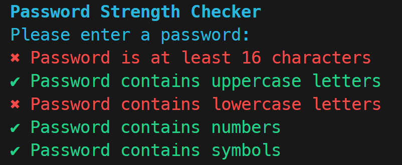

# CISA Password Strength Checker
Verify that your password meets the American [Cybersecurity and Infrastructure Security Agency criteria](https://www.cisa.gov/secure-our-world/require-strong-passwords) for a secure password. Run the script and enter your password and see which of the criteria it passes.



## Setup Instructions

### Prerequisites
Make sure you have the following installed:
- [Node.js](https://nodejs.org/) (Latest LTS version recommended)
- [npm](https://www.npmjs.com/) (Comes with Node.js)

### Installation
To install dependencies, run:

```sh
npm install
```

## Running the Project
To start the project, use:
```sh
npm start
```